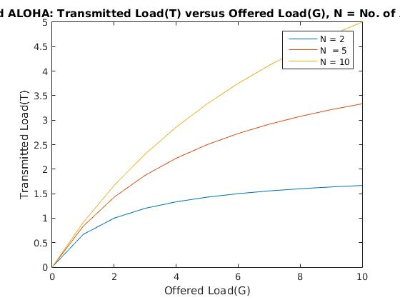
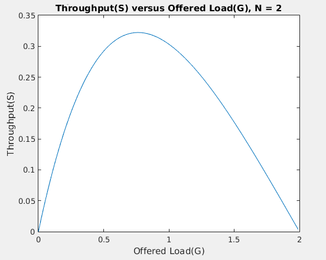
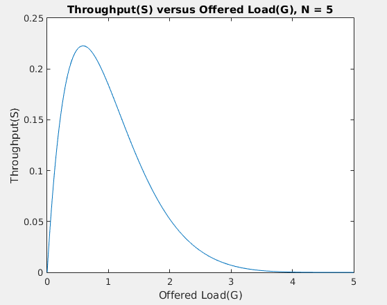
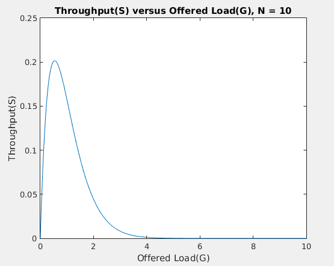
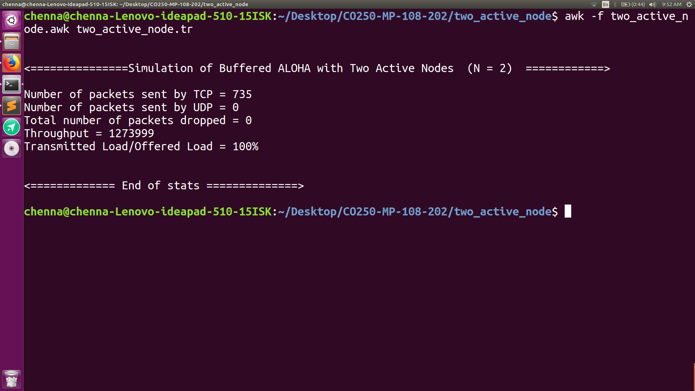
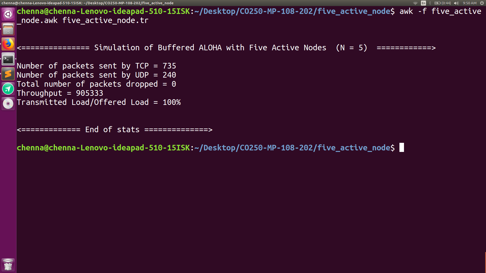
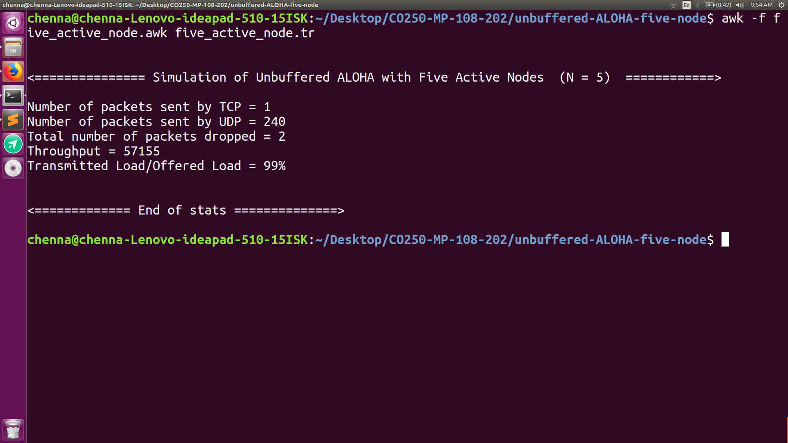

# Data Communication (CO250): Mini-Project
### Title:
Analysis of Buffering on the Throughput of ALOHA

### Abstract:

This repository contains the code for the implementation of this paper - "Effect of Buffering on the throughput of ALOHA". The paper can be found here - http://ieeexplore.ieee.org/document/7761123/	

This paper aims to explore the advantages of using ALOHA in media having a high relative propagation delay like Deep Underwater or Space communication. Previously it had been widely accepted that ALOHA could achieve a maximum throughput of 18.6%, which is substantially less than other complex MAC protocols like CSMA, T-Lohi, MACA and FS-MACA. But an important observation is that the performance of ALOHA is independent of the relative propagation delay of the medium, unlike any other complex MAC protocol.

Previously, Abramson had only derived the throughput performance under the assumption of infinite number of active nodes, the traffic following poisson’s distribution and every node producing traffic at random intervals. In this paper, the authors have mathematically derived the throughput performance for a finite number of active nodes with and without buffering. The experimental and analytical/simulation results  go hand-in-hand with each other. The collisions of packets has been classified into two types, and the effect of buffering in the ALOHA protocol is analysed for the two types of collisions separately.

### Objectives:
* Implement the buffered version of ALOHA and compare the throughput for wide range of finite active nodes to facilitate asymptotic analysis.
* Implement the un-buffered version of ALOHA and compare the throughput for wide range of finite active nodes to facilitate asymptotic analysis.

### References:
1. Paul, Jyoti, Trevor A. Wheatley, and Craig R. Benson. "Effect of buffering on the throughput of ALOHA." OCEANS 2016 MTS/IEEE Monterey. IEEE, 2016.
2. Wan, Tao, and Asrar U. Sheikh. "Performance and stability analysis of buffered slotted ALOHA protocols using tagged user approach." IEEE Transactions on Vehicular Technology 49.2 (2000): 582-593.

3. https://ns2blogger.blogspot.in/p/the-file-written-by-application-or-by.html (Very useful resource for AWK scripting, for parsing the trace files, generated by ns2)

### File Structure:

#### Unbuffered analysis of ALOHA:

##### unbuffered_theoritical_analysis.m: 
This code contains the implementation of Offered Load(G) versus Transmitted Load(T) and Throughput(S) versus Transmtted Load(T) analysis for different values of active nodes(N) = 2, 5, 10 and INF. All these graphs aare plotted on the same figure(unbuffered-ALOHA.jpg).

The obtained graph for different values of N is as follows:  

##### buffered ALOHA:

This code has been written as different files for different values of N = 2, 5 10. Each of the code-files produces a graph depicting the Offered Load(G) versus Transmitted Load(T) properties for that value of N. Hence, the appropriate files analysing buffered ALOHA protocol are: 
* *buffered_two_active_nodes_theoritical_graph.m* 
* *buffered_five_active_nodes_theoritical_graph.m*
* *buffered_ten_active_nodes_theoritical_graph.m*
  

  

  

### Analysis of Simulation using ns2
The situation presented in the research paper has been simulated using the ns2 tool. The original paper has used QUALNET simulator, but since this tool is proprietary, I have used ns2 simulator.
The following situations/topologies have been simulated. All the *.tcl scripts have been placed in the appropriately named sub-folders.
* Buffered ALOHA, with Two Active Nodes (two_active_node)
* Buffered ALOHA, with Five Active Nodes (five_active_node)
* Buffered ALOHA, with Ten Active Nodes (ten_active_node)
* Unbuffered ALOHA, with Five Active Nodes (unbuffered-ALOHA-five-node)
 
Each of the folders contain the following files:
* *.tcl script, which contains the specifics of the simulation
* *.nam file: This file is generated by the tcl script, used for animation purposes
* *.tr file: The trace file is also generated by .tcl script. This is used for analysis of the simulation
* *.awk : I wrote this file to parse the .tr file. This file calculates the throughput, offered Load and Transmitted Load properties.

#### Sample outputs of the awk scripts are as follows : 

   
<b>Stats of Buffered ALOHA, N = 2 </b>
  

   
<b>Stats of Buffered ALOHA, N = 5 </b>
   

  
<b>Stats of Buffered ALOHA, N = 10 </b>
   

  
<b> Stats of Unbuffered ALOHA, N = 10 </b>
  

### Challenges faced in Simulation scripts:
I faced a few challenges in reproducing the results of the original research paper. They are as follows:
1. I am not aware of any facility in ns2 to ensure that packets are generated in a random fashion, among all the nodes in a network.
2. I had to set the connections between two nodes manually, ie. set the tcp/usp protocols, then bind the nodes to  the agents, and then bind two agents together. This process became more tedious with increasing number of active nodes, N = 5 and N = 10.
3. I could not force all the nodes to generate and packets according to Poisson distribution. But, this was one of the key assumptions in the research paper.
4. I did not have any control over the Offered Load in the network. The analysis in the research paper compares the Offered Load versus Transmitted Load(T). But in my simulations, I was not able to dictate the Offered Load in the network.
5. As a workaround to point-4, I tried to set packet-duration parameter, so this allowed me to set the offered load in one link. But, then I will have to do this for all the other communicating links in the network.
6. I thought of passing the required offered load as a command line argument to the *.tcl script, but I am a new-commer to tcl scripting, so I could not implement the idea.
7. The analysis requires the calculation of throughput, T vs G, for varying values of T. I felt this warrants the usage of shell scripting. But, I first had to solve point-6, before automating the process.

It would be really great, if anyone could help with any of the above mentioned points. 

